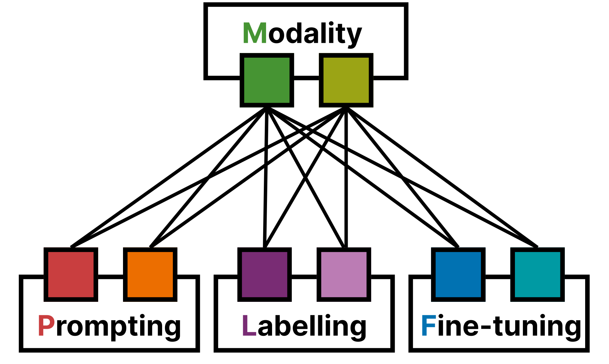

# Hateful Meme Detection through Context-Sensitive Prompting and Fine-Grained Labeling [English | [中文](./README.zh.md)]

This repository contains the codes and datasets used in our study.

  

*Figure 1. The conceptual framework*

## Paper

**Publication:** [AAAI 2025](https://aaai.org/conference/aaai/aaai-25/) (Student Abstract, Oral)  

**Authors:** [Rongxin Ouyang](https://rongxin.me/cv)$^1$, [Kokil Jaidka](https://discovery.nus.edu.sg/17291-kokil-jaidka)$^1$ $^2$, [Subhayan Mukerjee](https://discovery.nus.edu.sg/19113-subhayan-mukerjee)$^1$ $^2$, and Guangyu Cui $^2$

  $^1$ Department of Communications and New Media, National University of Singapore  
  $^2$ Centre for Trusted Internet \& Community, National University of Singapore

**Link to Paper:**

- Main: [`TBD`]
- Supplementary Information: [`TBD`]

## Dataset

Due to the size and copyright restrictions of the original dataset, please use the provided links to access the dataset for our study.

- [Hateful Memes Challenge and Dataset](https://ai.meta.com/tools/hatefulmemes/)

- [Hugging Face](https://huggingface.co/datasets/limjiayi/hateful_memes_expanded)

## Models

We thank all contributors of the prior models used in our study:

- [Sanh, V. (2019). DistilBERT, a distilled version of BERT: smaller, faster, cheaper and lighter. *arXiv preprint arXiv:1910.01108*.](https://arxiv.org/abs/1910.01108)[[Model Card](https://huggingface.co/distilbert/distilbert-base-uncased)] [[Fine-tuning Guide](https://huggingface.co/docs/transformers/model_doc/distilbert)]
- [Chen, Z., Wu, J., Wang, W., Su, W., Chen, G., Xing, S., ... & Dai, J. (2024). Internvl: Scaling up vision foundation models and aligning for generic visual-linguistic tasks. In *Proceedings of the IEEE/CVF Conference on Computer Vision and Pattern Recognition* (pp. 24185-24198).](https://openaccess.thecvf.com/content/CVPR2024/html/Chen_InternVL_Scaling_up_Vision_Foundation_Models_and_Aligning_for_Generic_CVPR_2024_paper.html) [[Model Card](https://huggingface.co/OpenGVLab/InternVL2-8B)] [[Fine-tuning Guide](https://internvl.readthedocs.io/en/latest/internvl2.0/quick_start.html)]
- [OpenAI (2023). GPT-4 Technical Report.](https://cdn.openai.com/papers/gpt-4.pdf) *(as a teacher)*

## File Structure

- `./dataset/`
  - `./dataset/raw/hateful_memes_expanded/` Meta Hateful Memes Meta Data
  - `./dataset/raw/hateful_memes_expanded/img/` Meta Hateful Memes Images
  - `...`
- `./process/`
  - `./process/internvl_finetuned/` Finetuned InternVL models
  - `...`
- `./script/`
  - `./script/1.finetune.distilbert.sample.ipynb` Finetuning DistilBERT (unimodal)
  - `./script/2.finetune.internvl.sample.sh` Finetuning Internvl 2.0 8B (multi-modal)
  - `./script/3.evaluation.batch.py` Evaluations of all models
  - `...`

## Acknowledgment

This work was supported by the Singapore Ministry of Education AcRF TIER 3 Grant (`MOE-MOET32022-0001`). We gratefully acknowledge invaluable comments and discussions with Shaz Furniturewala and Jingwei Gao.

## Bug Reports

- If you encountered any questions, feel free to reach out to Rongxin (rongxin$u.nus.edu). 😄

## Citation

`TBD`

## License

MIT License
